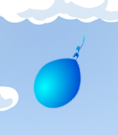
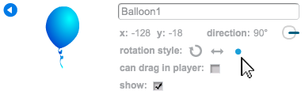

## Animating a balloon

--- task ---

Open a new Scratch project in the offline editor.

If you need to download and install the Scratch offline editor, you can find it at [rpf.io/scratchoff](http://rpf.io/scratchoff){:target="_blank"}.

--- /task ---

--- task ---

Delete the cat sprite.

--- /task ---

--- task ---

Add in a new balloon sprite, and a suitable stage backdrop.


--- /task ---


--- task ---

Add this code to your balloon, so that it bounces around the screen:


```blocks
	when flag clicked
	go to x:(0) y:(0)
	point in direction (45 v)
	forever
		move (1) steps
		if on edge, bounce
	end
```

--- /task ---

--- task ---

Test out your balloon. Does it move too slowly? Change the numbers in your code if you want to speed it up a bit.

--- /task ---

--- task ---

Did you also notice that your balloon flips as it moves around the screen?



Balloons don't move like this! To fix this, click on the balloon sprite icon, and then click the blue `i`{:class="blockmotion"} information icon.


In the 'rotation style' section, click the dot to stop the balloon rotating.



--- /task ---

--- task ---

Test your program again to see if the problem is fixed.

--- /task ---
